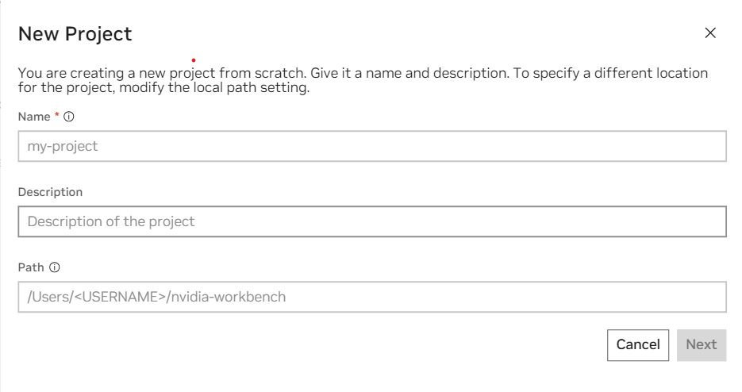
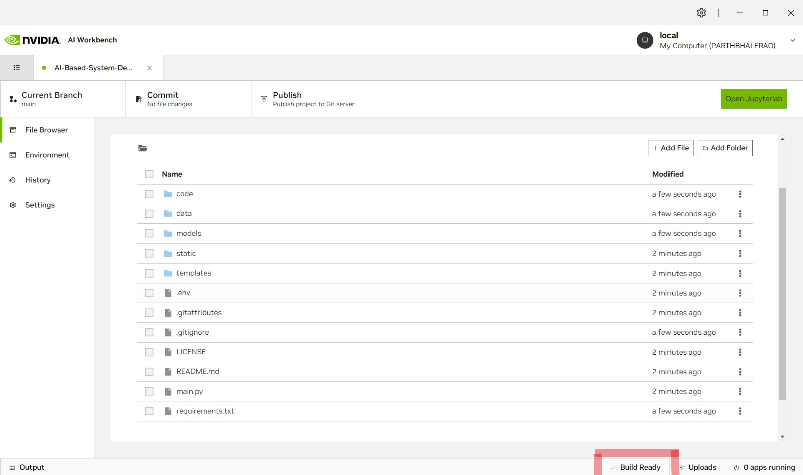
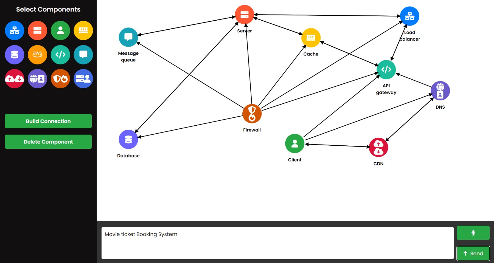

# AI-Based System Design Builder

This project provides an interactive platform for building and simulating system designs using AI. Powered by NVIDIA AI Workbench, it leverages advanced AI capabilities to generate optimized, scalable system architectures. 

## Prerequisites

Before running this project, make sure you have the following installed:

- **NVIDIA AI Workbench**: [Installation guide](https://docs.nvidia.com/ai-workbench/user-guide/latest/installation/overview.html)
- **Python 3.8+**
- **CUDA Toolkit** (for GPU acceleration)
- **Docker** (for containerized environments)


## Installation 

1. **Set Up NVIDIA AI Workbench**:
    - Follow the [Installation guide](https://docs.nvidia.com/ai-workbench/user-guide/latest/installation/overview.html) to set up the Workbench on your local machine or cloud environment.
    
    - Start the local server in Nvidia AI Workbench
    
   

    - Start new project, where you can clone the new repository from github.
    

2. **Clone the Repository in the new project**:
    ```bash
    git clone https://github.com/pvbgeek/AI-based-System-Design-Builder.git
    cd AI-based-System-Design-Builder 
    ```
    - After cloning the repository the project should be in a build-ready stage which you can see at the bottom right corner of the AI workbench.
    

3. **Launching NVIDIA Workbench using WSL**

- To start the NVIDIA Workbench environment on WSL, use the following command:

```bash
wsl -d NVIDIA-Workbench --cd ~
```


4. **Activate the NVIDIA Workbench Environment**:
   Use the following command to activate the local environment:
   ```bash
   nvwb activate local && nvwb open AI-Based-System-Design-Builder
   ```


3. **Install Dependencies and Configure environment variables**:
    ```bash
    pip install -r requirements.txt
    ```

4. **Run the application on CLI**
    ```bash
    python main.py
    ```


5. **Access the application on https://localhost:5000**

6. **Usage**
    - For phase I, We came up with a list of components which are essential for any system architecture.
    
    - User can manually select the components and build connections between the components.
    - User can also delete components by selecing them.
    - User can give audio input through mic functionality to describe the system requirements.
    - We have integrated and developed LLM based system design generation, where the user can give a prompt describing his system requirements and then the model can come up with architecture using the components predefined in the application. 
    

